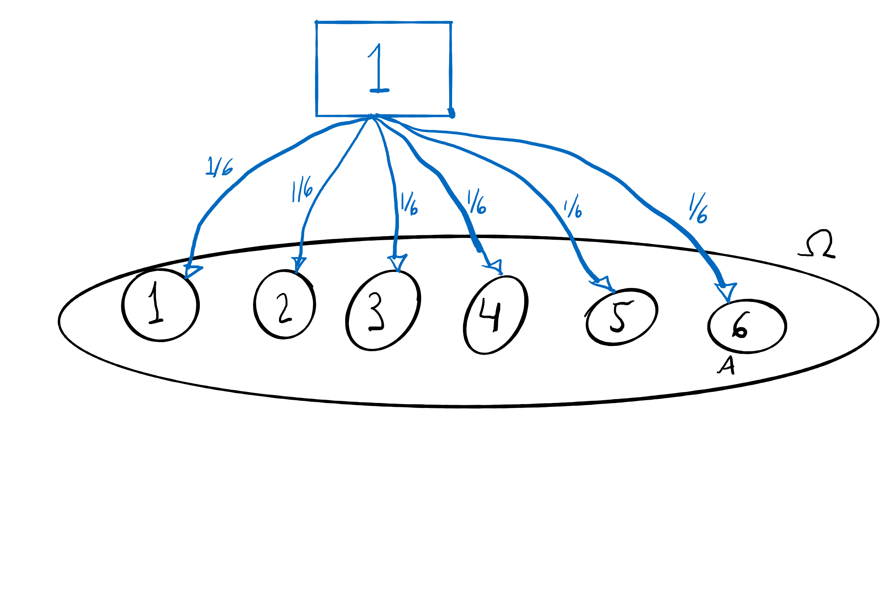
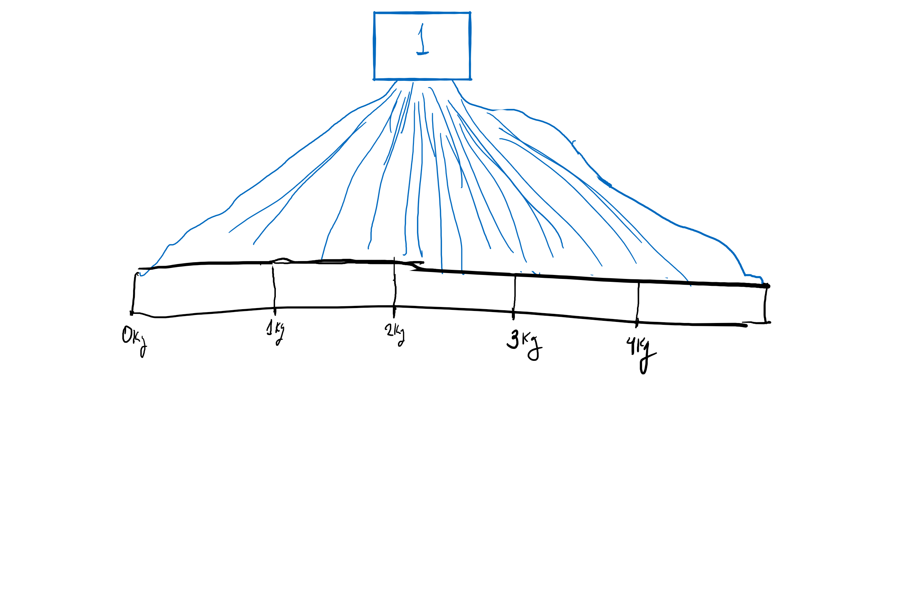

---
output:
  slidy_presentation:
    css: w3c-blue.css
    fig_caption: yes
    toc: yes
    toc_depth: 3
    code_folding: hide
    includes:
      in_header: header.html
      before_body: doc_prefix.html
      after_body: doc_suffix.html

bibliography: bibliography.bib
---

```{r, warning=FALSE, message=FALSE, echo=FALSE}

library(tidyverse)
library(ggbeeswarm)
library(ggforce)

```

```{r setup, include=FALSE}
 
knitr::opts_chunk$set(echo = TRUE, message = FALSE, warning = FALSE )
```

```{r, echo=FALSE}

remissivo <<- tibble(palavra = "####")

slide_atual <<- 1

a_r <- function(palavra_add){
    remissivo <<- remissivo %>% 
        bind_rows(tibble(palavra = palavra_add, slide = slide_atual))

    str_glue("**{palavra_add}**")
    
}


escreve_remissivo <- function(){
    
    remissivo_final <- remissivo %>% 
        slice(2:nrow(remissivo)) %>% 
        mutate(
            linha = row_number(),
            link = str_glue("[{palavra}](#({slide}))\n\n")
        ) %>% 
        arrange(palavra)
        
    str_flatten(remissivo_final$link, "\n\n")

}


```

# CURSO DE R PARA ANÁLISE DE DADOS - Inferência Causal

# INTRODUÇÃO

## Causalidade

`r slide_atual = slide_atual + 1`

::: {.left style="float:left;width:18%"}

:::

::: {.right style="float:right;width:78%"}
Tidymodels é um conjunto de bibliotecas que cuida de todos os passos necessários para desenvolver o workflow de seleção e avaliação de modelos de aprendizado estatístico.

O desenvolvimento é financiado pela RStudio e liderado por Max Kuhn, o principal desenvolvedor de uma biblioteca similar mais antiga: caret.

A tidymodels é toda tidy friendly. Essa é uma das diferenças em relação à caret. Ela também é mais completa e possui muito mais funcionalidades.

É possível obter mais informações em [tidymodels.org](https://www.tidymodels.org/)
:::

## Inferência Causal

`r slide_atual = slide_atual + 1`

É a área de conhecimento que desenvolve métodos para estimar o impacto de eventos e decisões em desfechos de interesse. Isso é feito partindo de um conhecimento tácito a respeito do contexto.

## Correlação x Causalidade

`r slide_atual = slide_atual + 1`

banco central, ladeira, barco a vela

## Dados Experimentais x Dados Observacionais

`r slide_atual = slide_atual + 1`

# PROBABILIDADE E REGRESSÃO

## Experimento aleatório

Um evento sobre cujo desfecho temos incerteza.

Experimento que ao ser repetido sob as mesmas condições observáveis não produz sempre o mesmo resultado.

-   Lançamento de dado
-   Sorteio de bolinhas azuis e vermelhas de uma urna
-   Sexo de uma criança ao nascer
-   Peso de uma criança ao nascer
-   Lançamentos de dardo em sequência por um atleta
-   Tempo de vida útil de uma lâmpada

## Espaço amostral

Espaço amostral é o conjunto de resultados possíveis

Experimentos discretos, onde o espaço amostral é enumerável (pode ser colocado em correspondência biunívoca com o conjunto dos naturais):

-   Lançamento de um dado: $\Omega = \{ 1\ pontinho,\ 2\ pontinhos,\ 3\ pontinhos,\ 4\ pontinhos\, \\ 5\ pontinhos,\ 6\ pontinhos\}$
-   Sorteio de bolinhas: $\Omega = \{ azul, vermelha \}$
-   Sexo de uma criança ao nascer: $\Omega = \{masculino, feminino\}$

Experimentos contínuos, onde o espaço amostral é não-enumerável:

-   Peso de uma criança ao nascer: $\Omega = \{x \in \mathbb{R}, x \geq 0 \}$

-   Lançamentos de dardo em sequência por um atleta: $\Omega = \{x: x \in \mathbb{R}, x \geq 0 \}$

-   Tempo de vida útil de uma lâmpada: $\Omega = \{x: x \in \mathbb{R}, x \geq 0 \}$


```{r}

samples <- tibble(
  sample = runif(n = 1000, min = 0, max = 1 ),
  type = "Continuous" 
) %>% 
  bind_rows(
    tibble(
      sample = sample(x = seq(0, by = 0.1, to = 1 ), size = 1000, replace = TRUE ),
      type = "Discrete" 
    )
  )


ggplot(samples) +
  geom_quasirandom(
    aes(
      x = sample,
      y = type,
    ),
    color = "darkblue",
    size = 0.3,
    alpha = 0.6,
    groupOnX =  FALSE
  ) +
  theme_minimal()


```

## Probabilidade

Probabilidade é uma função $\mathcal{P}: \mathcal{F} \to \mathbb{R}$  que distribui o montante de uma unidade (um montante 1) por subconjuntos que representam eventos do espaço amostral. Estes subconjuntos seguem algumas propriedades que não precisam ser detalhadas aqui, mas existem para garantir as propriedades da probabilidade que veremos adiante.

Um evento é definido por um subconjunto do espaço amostral.

Um evento simples é representado por um único elemento do espaço amostral

Um evento A do espaço amostral relativo ao lançamento de um dado pode ser definido como o equivalente a um dado ficar com a face 6 voltada para cima após o lançamento. Neste caso $A = \{6\ pontinhos\}$

Um evento B pode ser definido como um lançamento resultar em um número par. Neste caso $B = \{2\ pontinhos,\ 4\ pontinhos,\ 6\ pontinhos\}$

No caso de um dado, é claro que cada evento simples possível deve receber uma parte igual do "orçamento" de 1. Portanto a probabilidade de cada evento simples é 1/6. $P(A) = \frac{1}{6}$.

{width="50%"}

No caso de um espaço amostral contínuo, acontece o mesmo, a unidade é dividida nos elementos do espaço amostral, mas agora conjunto tem infinitos elementos não enumeráveis.

Um evento definido neste espaço engloba um intervalo de pontos. Por exemplo, o evento pode ser o nascimento de crianças de mais de 4kg.


{width="50%"}


Na figurinha, a densidade de orçamento distribuída é maior perto de 2,8kg, o valor mais frequente para o peso de um recém nascido.


A distribuição normal é uma boa aproximação para a distribuição deste orçamento de 1 pelos eventos para muitos casos onde temos um conjunto contínuo de eventos


```{r}

quantis <- seq(1, 5, length.out = 100 )

densidades <- dnorm(x =  quantis, mean = 2.8, sd = 0.5)

ggplot(
  
) +
  geom_area(
    aes(
      x = quantis,
      y = densidades
    ),
    size = 2,
    color = "darkblue",
    fill = "darkblue"
  ) +
  theme_minimal() +
  labs(
    x = "Peso (kg)",
    y = ""
  ) +
  theme(
    axis.text.y =  element_blank()
  )


```


Um aparato chamado Galton Board mostra fisicamente algo bem parecido com o que vimos:


<video width="320" height="240" controls>
  <source src="imagens/galton.mp4" type="video/mp4">
</video>


As probabilidades seguem os seguintes axiomas:

-   $P(\Omega) = 1$

-   Para todo conjunto A, $P(A) \geq 0$

-   Para toda sequência de eventos mutuamente exclusivos $A_1, A_2, ...$ temos $P\left ( \bigcup_{i = 1}^{\infty} A_i\right ) = \sum_{i=1}^\infty \left (P(A_i) \right )$, ou seja, a probabilidade da união de eventos mutuamente exclusivos é igual à soma da probabilidade desses eventos.

Esta é uma definição axiomática, que não fala sobre o significado do valor de probabiidade distribuído pelos elementos.

Queremos um número que reflita a chance de ocorrência de cada evento. 

Esse número pode ser pensado a partir de uma abordagem frequentista, onde a probabilidade é estimada a partir da frequência de ocorrência do evento em um número grande de execuções conhecidas e independentes do experimento aleatório: $f_{}n,a = \frac{n(A)}{n}$

Entretanto, nem sempre é possível conhecer um número grande desfechos para o evento aleatório nas mesmas condições. Neste caso, podemos adotar valores baseados na crença que temos na ocorrência de cada evento.  


## Probabilidade Condicional


O conceito de probabilidade condicional é importantíssimo.

A probabilidade condicional funciona como uma possível restrição ao espaço amostral de um evento B pela ocorrência de um evento A. 

Podemos exemplificar pelo espaço amostral dado pelo resultado do lançamento de um par de dados

```{r}

desfecho_par_dados <- tibble(
  dado_1 = 1L:6L
) %>% 
  crossing(
    tibble(
      dado_2 = 1L:6L
    )    
  )


espaco <- ggplot(desfecho_par_dados) +
  geom_point(
    aes(
      x = dado_1,
      y = dado_2
    ),
    size = 12,
    shape = 21,
    color = "darkblue",
    fill = "darkblue",
    alpha = 0.2
  ) +
  geom_text(
    aes(
      x = dado_1,
      y = dado_2,
      label = "1/36"
    )
  ) +
  scale_x_continuous(
    breaks = 1:6,
    minor_breaks = NULL
  ) +
  scale_y_continuous(
    breaks = 1:6,
    minor_breaks = NULL
  ) +
  theme_minimal() +
  theme(
    text = element_text(size = 18)
  ) + 
  labs(
    x = "\nDado 1",
    y = "Dado 2\n"
  ) +
  ggtitle(
    "Espaço amostral, lançamento par de dados"
  )


espaco


```


Podemos imaginar o seguinte evento:

A: em cada lançamento o valor do dado é menor ou igual a dois


```{r}


grafico_a <- ggplot(desfecho_par_dados) +
  geom_point(
    aes(
      x = dado_1,
      y = dado_2
    ),
    size = 12,
    shape = 21,
    color = "darkblue",
    fill = "darkblue",
    alpha = 0.2
  ) +
  geom_text(
    aes(
      x = dado_1,
      y = dado_2,
      label = "1/36"
    )
  ) +
  scale_x_continuous(
    breaks = 1:6,
    minor_breaks = NULL,
    limits = c(0,7)
  ) +
  scale_y_continuous(
    breaks = 1:6,
    minor_breaks = NULL,
    limits = c(0,7)
  ) +
  theme_minimal() +
  theme(
    text = element_text(size = 18)
  ) + 
  labs(
    x = "\nDado 1",
    y = "Dado 2\n"
  ) +
  ggtitle(
    "Espaço amostral, lançamento par de dados"
  ) + 
  annotate(
    "rect",
    xmin = 0.5,
    xmax = 2.5,
    ymin = 0.5,
    ymax = 2.5,
    color = "white",
    fill = "darkred",
    alpha = 0.2
  ) +
  annotate(
    x = 0.3,
    y = 1.5,
    geom = "text",
    label = "A",
    color = "darkred"
  )

grafico_a

```


Podemos definir também outro evento:

B = a soma dos lançamentos é 4


```{r}


grafico_a_b <- grafico_a +
  annotate(
    geom = "segment",
    x = 3.5,
    y = 0.5,
    xend = 0.5,
    yend = 3.5,
    color = "darkgreen",
    size = 14,
    alpha = 0.2
  ) +
  annotate(
    x = 0.3,
    y = 3.5,
    geom = "text",
    label = "B",
    color = "darkgreen"
  )

grafico_a_b


```
Neste caso as probabilidades dos eventos são essas:


$$P(A) = \frac{4}{36} = \frac{1}{9}$$

$$P(B) = \frac{3}{36} = \frac{1}{12}$$


Se quisermos calcular a probabilidade do evento B dado que o evento A ocorreu, ou seja $P(B|A)$, precisamos considerar que partimos de um novo espaço amostral: o espaço amostral onde A acontece.

Ou seja:

$$P(B|A) = \frac{P(A,B)}{P(A)}$$


## Eventos independentes


Dois eventos são independentes quando a ocorrência de um evento não muda a probabilidade de ocorrência do outro evento. Ou seja: $P(A) = P(A|B)$

Os eventos relacionados ao lançamento de um segundo dado são independentes dos eventos correspondentes ao lançamento do primeiro dado.

Se considerarmos os eventos A = dado 1 deu resultado 6 e B = dado 2 deu resultado 6, eles são independentes. 

Um evento não restringe o espaço amostral do outro evento

```{r}

espaço_amostral_independentes = tibble(resultado = 1:6 ) %>% 
  crossing(
    dado = c("Dado 1", "Dado 2")
  )


grafico_independentes <- ggplot(espaço_amostral_independentes) +
  geom_rect(
    data = tibble(
      xmin = 0.7,
      ymin = 0.2,
      ymax = 6.8,
      xmax = 1.3,
      dado = c("Dado 2", "Dado 1")
    ),
    aes(
      xmin = xmin,
      ymin = ymin,
      xmax = xmax,
      ymax = ymax,
    ),
    fill = "gray",
    size = 14,
    alpha = 0.7
  ) + 
  geom_point(
    aes(
      x = 1,
      y = resultado
    ),
    size = 12,
    shape = 21,
    color = "darkblue",
    fill = "darkblue",
    alpha = 0.2
  ) +
  geom_text(
    aes(
      x = 1,
      y = resultado,
      label = "1/6"
    )
  ) +
  scale_y_continuous(
    breaks = 1:6,
    minor_breaks = NULL,
    limits = c(0,7)
  ) +
  scale_x_continuous(
    limits = c(0,2)
  ) +
  theme_minimal() +
  theme(
    text = element_text(size = 18)
  ) + 
  ggtitle(
    "Espaço amostral, lançamento par de dados"
  ) + 
  geom_segment(
    data = tibble(
      x = 1,
      y = 5.5,
      xend = 1,
      yend = 6.5,
      dado = "Dado 1"
    ),
    aes(
      x = x,
      xend = xend,
      y = y,
      yend = yend
    ),
    color = "darkgreen",
    size = 14,
    alpha = 0.2
  ) + 
  geom_segment(
    data = tibble(
      x = 1,
      y = 5.5,
      xend = 1,
      yend = 6.5,
      dado = "Dado 2"
    ),
    aes(
      x = x,
      xend = xend,
      y = y,
      yend = yend
    ),
    color = "darkred",
    size = 14,
    alpha = 0.2
  ) + 
  facet_wrap(
    ~dado
  ) +
  theme(
    axis.text.x = element_blank()
  ) +
  labs(
    x = "",
    y = "Resultado\n"
  ) +
  geom_text(
    data = tibble(
      x = 0.8,
      y = 6,
      dado = "Dado 1"
    ),
    aes(
      x = x,
      y = y
    ),
    color = "darkgreen",
    label = "A"
  ) + 
  geom_text(
    data = tibble(
      x = 0.8,
      y = 6,
      dado = "Dado 2"
    ),
    aes(
      x = x,
      y = y
    ),
    color = "darkred",
    label = "B"
  ) + 
  facet_wrap(
    ~dado
  ) +
  theme(
    axis.text.x = element_blank()
  ) +
  labs(
    x = "",
    y = "Resultado\n"
  ) 
  


grafico_independentes

```


Como 

$$P(B|A) = \frac{P(A,B)}{P(A)}$$,  

então:

$$P(A,B) = P(A) P(B|A)$$


## Variável aleatória

Mais uma vez consideramos que $\Omega$ é o conjunto de eventos do nosso espaço amostral

Variável aleatória é uma função que atribui número real a cada ponto de $\Omega$ que representa um evento, sendo que estes eventos precisam estar consistentes com a definição de probabilidade apresentada anteriormente e deve ser possível atribuir uma probabilidade a eles.

Ou seja:

$$ X: \Omega \to \mathbb{R}  $$


No caso do dado, onde temos $\Omega = \{ 1\ pontinho,\ 2\ pontinhos,\ 3\ pontinhos,\ 4\ pontinhos\, \\ 5\ pontinhos,\ 6\ pontinhos\}$, a variável aleatória mais usual é a função que relaciona o cada evento $\omega$ possível ao número de pontinhos. 

Ou seja, se considerarmos que $\omega_1 = "1\ pontinho\ pra\ cima"$, $X(\omega_1) = 1$

A variável aleatória nos ajuda a ter uma mensuração dos eventos na linguagem dos números reais.

Como agora usamos a ferramenta da Variável Aleatória para relacionar eventos (associados a probabilidades de ocorrência) a números reais, podemos definir o que é o valor esperado dessa variável aleatória, que vai ser um número real.

O valor esperado da variável aleatória X nada mais é que a soma dos possíveis $X(\omega)$, onde $\omega \in \Omega$, ponderada pela probabilidade de ocorrência desses pontos, $P(\omega)$

No caso do nosso dado, temos a situação de uma Variável Aleatória discreta:

$$ E(X) = \sum_{\omega \in \Omega}{P(\omega)X(\omega)}$$

No R:

```{r}

sum((1:6)*(1/6))

```


## Lei dos grandes números


A lei dos grandes números, nume definição não muito precisa, mas suficiente para os nossos propósitos, diz que a média de uma amostra fica mais próxima da média real da população à medida em que o tamanho da amostra cresce


Imagina que temos um dado. Sabemos que a média será a seguinte


```{r}


```


